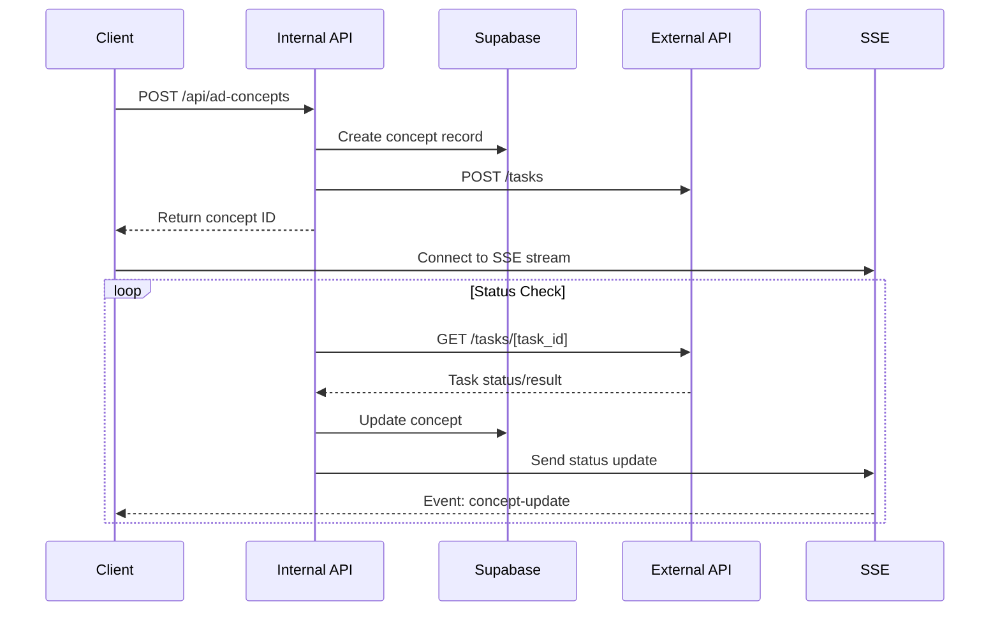

# API and Server-Sent Events Flow Documentation

## Overview
The application uses a combination of internal APIs (Next.js API routes), an external AI service API, and Server-Sent Events (SSE) for real-time updates. This document details all API endpoints, their interactions, and the data flow between different parts of the system.

## Internal API Endpoints

### 1. Ad Concepts API (`/api/ad-concepts`)

#### POST `/api/ad-concepts`
Creates a new concept for an ad.

**Request Headers:**
```typescript
{
  'Content-Type': 'application/json',
  'Cookie': 'auth_token=<jwt_token>' // JWT authentication
}
```

**Request Body:**
```typescript
{
  ad_archive_id: string;
  image_url: string;
}
```

**Response:**
```typescript
{
  id: string;           // Concept ID
  task_id: string;      // External API task ID
  status: 'pending';
  ad_archive_id: string;
}
```

**Error Response:**
```typescript
{
  error: string;
  status: number;
}
```

#### GET `/api/ad-concepts/[id]`
Retrieves a specific concept by ID.

**Request Headers:**
```typescript
{
  'Cookie': 'auth_token=<jwt_token>'
}
```

**Response:**
```typescript
{
  id: string;
  task_id: string;
  status: 'pending' | 'processing' | 'completed' | 'failed';
  concept_json?: object;
  error?: string;
  ad_archive_id: string;
}
```

### 2. SSE Endpoint (`/api/ad-concepts/[id]/stream`)

#### GET `/api/ad-concepts/[id]/stream`
Establishes an SSE connection for real-time concept status updates.

**Request Headers:**
```typescript
{
  'Accept': 'text/event-stream',
  'Cookie': 'auth_token=<jwt_token>'
}
```

**SSE Events:**
```typescript
{
  event: 'concept-update',
  data: {
    status: 'pending' | 'processing' | 'completed' | 'failed';
    concept_json?: object;
    error?: string;
  }
}
```

## External API Integration

### AI Service API

#### POST `/tasks`
Initiates concept generation task.

**Request Headers:**
```typescript
{
  'Content-Type': 'application/json'
}
```

**Request Body:**
```typescript
{
  ad_archive_id: string;
  image_url: string;
}
```

**Response:**
```typescript
{
  task_id: string;
  status: 'pending';
}
```

#### GET `/tasks/[task_id]`
Checks task status and retrieves results.

**Response:**
```typescript
{
  task_id: string;
  status: 'pending' | 'processing' | 'completed' | 'failed';
  result?: {
    concept_json: object;
  };
  error?: string;
}
```

## Data Flow and Interactions

### 1. Concept Generation Flow



### 2. Error Handling and Retries

1. **API Error Handling**
   - All endpoints return standardized error responses
   - HTTP status codes are properly mapped
   - Authentication errors return 401
   - Validation errors return 400
   - Server errors return 500

2. **Retry Mechanism**
   - Failed concept generation can be retried
   - SSE connection automatically reconnects on failure
   - External API polling has exponential backoff

### 3. Authentication Flow

1. **JWT Token Flow**
   - Token stored in HTTP-only cookie
   - All API requests include cookie automatically
   - SSE connection maintains authentication
   - Token validation on every request

2. **Security Measures**
   - CORS properly configured
   - Rate limiting implemented
   - Request validation
   - Sanitized error messages

## Environment Configuration

### Development
```env
NEXT_PUBLIC_EXTERNAL_API_URL=http://localhost:3006
```

### Production
```env
NEXT_PUBLIC_EXTERNAL_API_URL=http://146.190.42.147:3006
```

## Best Practices

1. **API Calls**
   - Always include error handling
   - Validate input before sending
   - Handle loading states
   - Implement proper timeouts

2. **SSE Handling**
   - Reconnect on connection loss
   - Handle message parsing errors
   - Clean up connections on component unmount
   - Monitor connection health

3. **External API**
   - Implement request queuing
   - Handle rate limits
   - Monitor task timeouts
   - Log all interactions

## Monitoring and Debugging

1. **API Monitoring**
   - Request/response logging
   - Error rate tracking
   - Response time monitoring
   - Status code distribution

2. **SSE Monitoring**
   - Connection status
   - Event delivery rates
   - Reconnection attempts
   - Message processing errors

3. **External API Monitoring**
   - Task completion rates
   - Error distribution
   - Processing times
   - API availability 